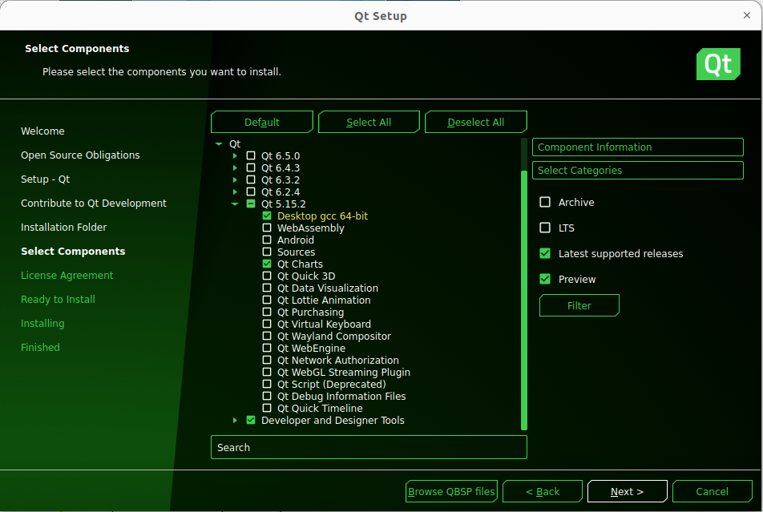
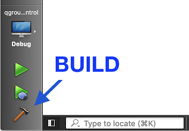

# Install PX4-Autopilot

**Step 1: Download PX4 Source Code**

```bash
$ git clone https://github.com/PX4/PX4-Autopilot.git --recursive
```

**Step 2: Run the ```ubuntu.sh``` with no arguments (in a bash shell) to install everything**

```bash
$ bash ./PX4-Autopilot/Tools/setup/ubuntu.sh
```

**Step 3: Simulation using**

```bash
$ make px4_sitl jmavsim
```

# Install VS Code Editor

**Step 1: Open Command Terminal and Run**

```bash
$ sudo apt update
```

**Step 2: Download VScode**

```bash
$ wget -O vscode.deb 'https://code.visualstudio.com/sha/download?build=stable&os=linux-deb-x64'
``` 

**Step 3: Install Visual Code Binary**

```bash
$ sudo apt install ./vscode.deb
```

# Build QGroundControl Ground Control Station

**Step 1: Clone the repo (or your fork) including submodules**

```bash
$ git clone --recursive -j8 https://github.com/mavlink/qgroundcontrol.git
```

Update submodules (required each time you pull new source code):

```bash
$ cd qgroundcontrol
$ git submodule update --recursive
```

**Step 2: Install Qt**

You need to install Qt as described below instead of using pre-built packages from say, a Linux distribution, because QGroundControl needs access to private Qt headers.

**1. Download and run the Qt Online** [Installer](https://www.qt.io/download-open-source)

After set the downloaded file to executable using: 

```bash
$ sudo chmod +x qt-unified-linux-x64-4.5.2-online.run
$ sudo apt install libxcb-xinerama0
```

Install to default location for use with 

```bash
$ ./qt-unified-linux-x64-4.5.2-online.run 
```

If you install Qt to a non-default location you will need to modify **qgroundcontrol-start.sh** in order to run downloaded builds.

**2. In the installer Select Components dialog choose: 5.15.2.**

Then install just the following components:

- Desktop gcc 64-bit
- Qt Charts
- Android ARMv7 (optional, used to build Android)



**3. Install Additional Packages (Platform Specific)**

```bash
$ sudo apt-get install speech-dispatcher libudev-dev libsdl2-dev patchelf build-essential curl
```

**4. Install Optional/OS-Specific Functionality**

Install [Video Streaming/Gstreamer](https://github.com/mavlink/qgroundcontrol/blob/master/src/VideoReceiver/README.md)

**5. Disable platform-specific optional features that are enabled (but not installed), by default**

Airmap: Create a file named ```user_config.pri``` (in the repo root directory) containing the text ```DEFINES += DISABLE_AIRMAP```. This can be done in a bash terminal using the command:

```bash
$ echo -e "DEFINES += DISABLE_AIRMAP\r\n" | tee user_config.pri
```
**Step 3: Building**

Launch ```Qt Creator``` and open the **qgroundcontrol.pro** project.

In the **Projects** section, select **Desktop Qt 5.15.2 GCC 64bit**

Build using the "hammer" (or "play") icons:



This is the end of tutorial. Hope you like it.
